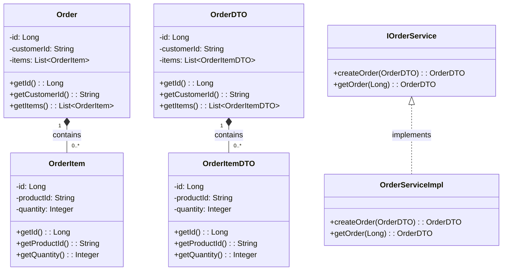
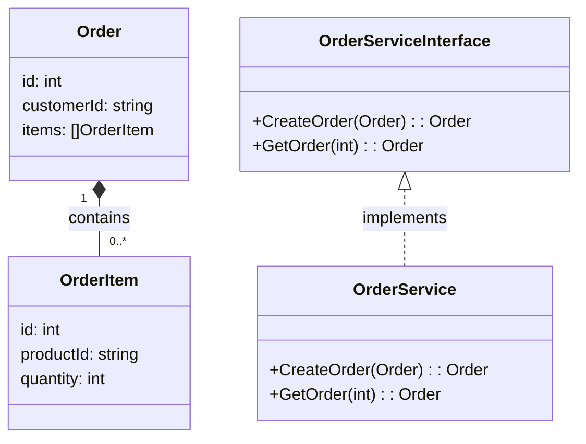

# java-to-golang-orders-lab

Laboratório de microserviços de pedidos implementados em **Java 21 + Spring Boot** e em **Go**, usando **PostgreSQL** e **RabbitMQ** via Docker.  
Objetivo: comparar mentalidade, arquitetura e código entre Java e Go em um cenário realista (Order API + Order Worker).

## Visão geral

Arquitetura (alto nível):

- `order-api` (Java e Go): API REST para criar e consultar pedidos.
- `order-worker` (Java e Go): consumidor de fila que processa eventos de pedidos.
- `PostgreSQL`: persistência dos pedidos.
- `RabbitMQ`: fila de eventos de pedidos.

## Pré-requisitos

- Docker + Docker Compose instalados.
- Java 21 instalado (ou compatível com os builds Java 21).
- Go 1.22+ instalado (ou versão recente equivalente).

## Diagramas de Classes
#### Java


#### Go


## Variáveis de ambiente

Crie um arquivo `.env` na raiz a partir de `.env.example`:
> cp .env.example .env

Exemplo de `.env`:

```
POSTGRES_DB=ordersdb
POSTGRES_USER=orders
POSTGRES_PASSWORD=orderspass

PGADMIN_DEFAULT_EMAIL=admin@example.com
PGADMIN_DEFAULT_PASSWORD=admin

RABBITMQ_DEFAULT_USER=dev
RABBITMQ_DEFAULT_PASS=dev
```

## Subindo a infraestrutura (Postgres + pgAdmin + RabbitMQ)

Na raiz do projeto:
> docker compose up -d

Serviços:

- Postgres: `localhost:5433` (host `postgres` na rede Docker).
- pgAdmin: `http://localhost:5050`
- RabbitMQ Management: `http://localhost:15672` (usuário/senha do `.env`).

Para derrubar:
> docker compose down

## Rodando os serviços Java

Na raiz do repositório (exemplos, podem mudar conforme o `pom.xml` final):

Order API (Java)

> cd java/order-api

> ./mvnw spring-boot:run

Order Worker (Java)

> cd java/order-worker

> ./mvnw spring-boot:run

A API deve subir, por padrão, em:

- `http://localhost:8080` (Java Order API)

## Rodando os serviços Go

Na raiz do repositório:

Order API (Go)
> cd go/order-api

> go run ./cmd/api

Order Worker (Go)
> cd go/order-worker

> go run ./cmd/worker

Por padrão (ajustaremos depois no código):

- `http://localhost:8081` (Go Order API)

## Testes

Java:
> cd java

> ./mvnw test

Go:

> cd go/order-api

> go test ./...

> cd go/order-worker
> go test ./...

## Próximos passos

- [ ] Adicionar diagramas C4 em `docs/c4` usando Mermaid.
- [ ] Implementar o domínio de pedidos em Java e Go (entidades, DTOs, serviços, repositórios).
- [ ] Conectar as aplicações ao Postgres e ao RabbitMQ usando as configurações do `docker-compose.yml`.
- [ ] No README de cada repo, colocar uma seção “Labs relacionados” com link para o outro, que fazem parte de uma mesma trilha Java ↔ Go.